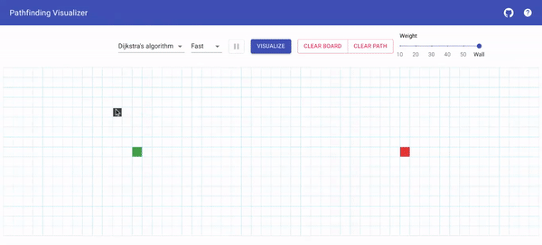

# Pathfinding Visualizer



## Installation

```bash
git clone https://github.com/vivekarora-02/PathFinding-Visualizer.git
cd PathFinding-Visualizer
npm install
npm start
```
## Demo
https://pathfinding-visualizerbyvivek.netlify.app/

## Algorithm List

Weighted:

- Dijkstra's algorithm

- A\* search algorithm (Manhattan distance heuristic)

Unweighted:

- Breadth-first search

- Depth-first search

## Thanks

Inspired by [Pathfinding-Visualizer](https://github.com/baeharam/Pathfinding-Visualizer) by [배하람](https://github.com/baeharam)
